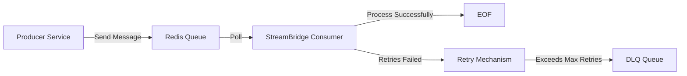

# ⚡ StreamBridge — Pluggable Messaging Framework

**StreamBridge** is a lightweight, modular messaging framework built with **Java** and **Spring Boot**.  
It enables **decoupled, high-throughput asynchronous communication** between microservices, with pluggable backends like **Redis** or **Kafka** — without requiring code changes in consumers.

---

## 🚀 Features

- 🔄 **Backend Abstraction:** Swap Redis, Kafka, or other systems without modifying consumer code.  
- 💥 **Retry & Dead-Letter Queue (DLQ):** Automatically retries failed messages and pushes permanently failed ones to a DLQ.  
- ⚙️ **High Throughput:** Efficiently handles thousands of messages per queue with configurable concurrency.  
- 🧩 **Reusable JAR Modules:** Core framework and backend connectors modularized as reusable JARs for plug-and-play integration.  
- 🧾 **YAML-Driven Config:** Queues, concurrency, retry strategy, and backoff policies are fully configurable.  
- 🧠 **Internal Logic Swapping:** Easily modify send/receive logic without impacting services using the JAR.  
- 🧵 **Multi-Queue Processing:** Supports multiple queues under a single instance.  
- 👨‍💻 **Developer-Friendly API:** Minimal boilerplate, consistent producer/consumer interfaces.

---

## 📂 Repository Structure

streambridge\
├── root/pom.xml # Basic Spring Boot Starters\
├── message-broker/ # Common contracts, abstractions, and interfaces \
├── redis-message-broker/ # Redis-specific implementation \
├── kafka-connector/ # (Optional / Future) Kafka implementation \
├── demo-app/ # Sample app demonstrating usage \
└── README.md 


---

## 🛠️ Getting Started

### 1️⃣ Add Dependencies
Adding an implementation (redis/kafka) to sample project is as easy as adding the dependency in the project's pom.xml
```xml
<dependency>
	<groupId>com.broker</groupId>
	<artifactId>redis-message-broker</artifactId>
	<version>0.0.1-SNAPSHOT</version>
</dependency>
```

### 2️⃣ Configure YAML
```yaml
#Adding Redis Config
redis-servers:
  redisConfigs:
  - name: server1
    host: 192.168.0.0
    port: 8080
    maxIdle: 5
    maxTotal: 5 

#Adding queues
queues:
  producers:
  - queue: BigQueue
    server: server1
    messageSerializer: DefaultMessageSerializer
    filter: MessageSizeFilter
    filterCriteria: GE 10

  - queue: SmallQueue
    server: server1
    messageSerializer: DefaultMessageSerializer
    filter: MessageSizeFilter
    filterCriteria: LT 10

  #Readers which will listen on those queues
  readers:
  - queue: SmallQueue
    server: server1
    messageProcessor: SimpleMessageProcessor
    messageSerializer: DefaultMessageSerializer
    numberOfInstances: 1
  - queue: BigQueue
    server: server1
    messageProcessor: SimpleMessageProcessor
    messageSerializer: DefaultMessageSerializer
    numberOfInstances: 1
```

# 3️⃣ Producer Example
```java
@Autowired
private Notifier notifier;

notifier.sendMessage("Message", (Object)Filter);
```
# 4️⃣ Consumer Example
The consumer will automatically poll the queue mentioned in the yaml and use the appropriate messageProcessor to process the messagge

# 5️⃣ DLQ Handling
If a message fails after all retries, it is moved to a <queue>.dlq.
You can create a consumer or dashboard to inspect or reprocess these messages.

---
\
\
📈 Performance & Design
⚡ Setup Efficiency: Reduces setup time by ~70% compared to manual message handling.

📦 Scalability: Configurable consumer threads (e.g., 20–50) for parallel processing.

🧲 Reliability: Retry + DLQ ensures no message loss.

🧰 Extensibility: Swap backend logic or serializers with zero service changes.

💡 Example Use Cases
🔔 Alerting Systems: Queue and process alerts (email/SMS) reliably.

⚙️ Background Jobs: Run async jobs like report generation, file parsing, etc.

🧠 Event Processing: Build event-driven microservice ecosystems.

🕹 Workflow Orchestration: Manage multi-step asynchronous flows.

🧭 Roadmap
✅ Add Kafka connector for backend interchangeability.

📊 Integrate Prometheus/Micrometer metrics for monitoring throughput.

🧾 Build DLQ Dashboard for inspection and replay.

🕒 Support Priority Queues, Delayed Jobs, and Batch Processing.

🧑‍💻 Contributing
Contributions are welcome!
Fork the repository, raise issues, and open PRs for new connectors or improvements.

📜 License
Licensed under the MIT License — free for personal and commercial use.

👤 Author\
Parmeet Singh Banwait\
🔗 [singhparmeetb](https://www.linkedin.com/in/singhparmeetb/)\

🏗️ Architecture Overview

